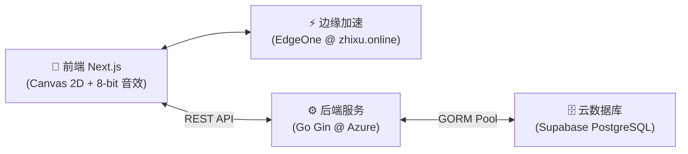

# 🐍 贪吃蛇 (Snake) - 极简全栈现代版

[](https://nextjs.org/)
[](https://gin-gonic.com/)
[](https://supabase.com/)
[](https://opensource.org/licenses/MIT)

> 🌟 **在线即玩**：[https://zhixu.online](https://zhixu.online)  
> 📖 **设计理念**：传承经典像素，融入极简留白美学、天青蓝 (`#66CCFF`) 核心主色、等宽几何徽标体系与全栈云原生架构。

---

## 🏛️ 系统架构



---

## 🌟 核心特性

- 🎨 **天青蓝极简美学**：纯白底板 (`#FFFFFF`) + 天青蓝 (`#66CCFF`) 主色，单行人文大标题与留白排版。
- 📱 **移动端双触控**：支持全屏手指滑屏转向与自适应半透明虚拟十字键。
- ⚡ **双指令缓冲队列**：单步物理位移严格消费排队方向，彻底杜绝快速连续转向自杀误判。
- 🎵 **原生 8-bit 音效**：Web Audio API 纯数学合成吃果、碰撞与暂停音效，0 外部资源开销。
- 🍎 **动态难度与幸运果**：平滑速度梯度；吃果概率触发 8 秒限时金色幸运果 (+30 分)。
- 🏆 **几何数字排行榜**：22px 等宽几何徽标（冠军金、亚军天青蓝、季军翡翠绿），高亮当前玩家并呈现超越百分比。
- 🛡️ **物理防作弊**：后端严格校验单局得分/耗时物理极限，拦截恶意脚本。
- 🗄️ **Supabase 持久化**：GORM 自动建表，双表存储账户与每局战绩流水。
- 📲 **PWA 应用化**：支持“添加到手机主屏幕”全屏独立运行。

---

## 📂 目录结构

```text
├── client/                     # 前端应用 (Next.js)
│   ├── app/                    # 页面、路由与全局样式
│   ├── components/             # Header, GameBoard, Leaderboard, LoginCard
│   ├── hooks/                  # 游戏引擎 useSnakeGame 与认证钩子
│   ├── utils/                  # Web Audio API 8-bit 音效
│   ├── .env.example            # 前端环境变量范本
│   └── .gitignore              # 前端忽略规则
│
├── server/                     # 后端服务 (Go Gin)
│   ├── main.go                 # API 接口、防刷分校验与数据库连接
│   ├── .env.example            # 后端环境变量范本
│   └── .gitignore              # 后端忽略规则
│
├── supabase/migrations/        # 数据库 SQL 迁移文件
├── AGENTS.md                   # 仓库开发宪法与技术规范
└── README.md                   # 全局文档
```

---

## 🚀 快速上手

### 后端启动
```bash
cd server
go run main.go
# 默认监听 http://localhost:8080
```

### 前端启动
```bash
cd client
npm install
npm run dev
# 浏览器访问 http://localhost:3000
```

---

## 📜 开源协议

本项目遵循 [MIT License](LICENSE) 协议。
