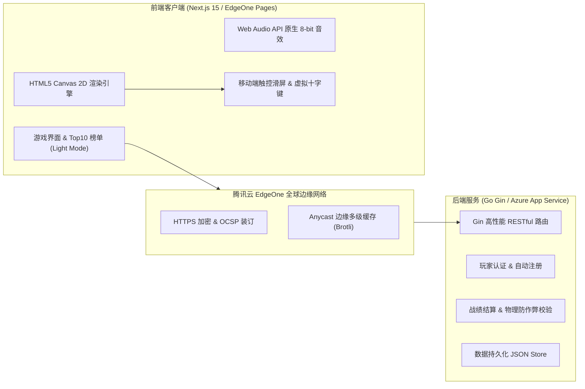

# TanChiShe 2026 (贪吃蛇前后端分离系统)

> 南昌大学《程序设计课程设计》—— 题目 31《贪吃蛇游戏》课程设计工程项目。

[](https://zhixu.online)
[](https://nextjs.org/)
[](https://gin-gonic.com/)
[](https://azure.microsoft.com/)
[](https://edgeone.ai/)

---

## 🌐 线上永久运行地址

- 🎮 **游戏前台**：[https://zhixu.online](https://zhixu.online)（支持电脑端与手机触控操作）
- 🚀 **后端 API**：[https://tanchishe-epd8b5h0gwf9fcd0.eastasia-01.azurewebsites.net](https://tanchishe-epd8b5h0gwf9fcd0.eastasia-01.azurewebsites.net)

---

## 📖 项目简介

本项目采用现代前后端分离架构开发，前端基于 **Next.js 15 (App Router) + TypeScript + HTML5 Canvas 2D + Tailwind CSS**，后端基于 **Go 语言 + Gin 高性能 Web 框架**。

系统严格贯彻面向对象与分层解耦设计，界面采用**清爽浅色系（Light Mode）**极简风格，兼顾现代感与规范性。

---

## 🏗️ 系统架构图



---

## 🎮 核心机制与特色功能

1. **📱 移动端与电脑端双端自适应**：
   - 电脑端：支持键盘 `方向键` / `WASD` 移动，`空格` 开始/重来，`P` 键暂停；
   - 移动端：支持全屏 **Touch 滑动转向** 与底部 **极简微型触控十字方向键**。
2. **⚡ 双指令转向缓冲队列**：
   - 彻底杜绝快速连续按键时的原地折返碰撞与自杀误判。
3. **🍎 动态难度与金色幸运果**：
   - 贪吃蛇速度随得分增长平滑微调提升；
   - 随机刷出限时 8 秒金色幸运果（+30 分）。
4. **🎵 原生 Web Audio API 8-bit 音效**：
   - 纯正弦波数学合成清脆吃果、碰撞死亡与暂停音效，0 资源体积，支持一键静音。
5. **🏆 Top 10 全球实时榜单**：
   - 高亮当前玩家记录，自动计算全服战绩超越百分比。
6. **🛡️ 后端物理防作弊校验**：
   - 上报战绩时服务端自动校验得分/耗时比，拦截恶意刷分请求。
7. **📲 PWA 原生应用体验**：
   - 支持手机浏览器“添加到主屏幕”，全屏沉浸式无地址栏游玩。

---

## 🛠️ 本地运行与开发

### 1. 后端 (Go Gin)
```bash
cd server
go run main.go
# 服务运行于 http://localhost:8080
```

### 2. 前端 (Next.js)
```bash
cd client
npm install
npm run dev
# 访问 http://localhost:3000
```
