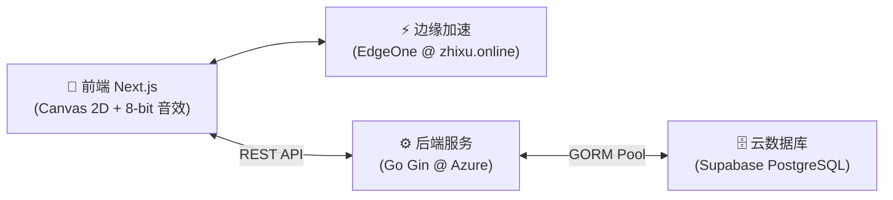

# 🐍 贪吃蛇 (Snake) - 极简全栈现代版

[](https://nextjs.org/)
[](https://gin-gonic.com/)
[](https://supabase.com/)
[](https://opensource.org/licenses/MIT)

> 🌟 **在线即玩**：[https://zhixu.online](https://zhixu.online)  
> 📖 **设计理念**：南大家园纯白留白美学 + 天青蓝 (`#66CCFF` / `#0099FF`) + 多巴胺胶囊与几何徽标。

---

## 🏛️ 系统架构



---

## 🌟 核心特性

- 🎨 **南大天青蓝美学**：纯白底板 + 天青蓝主色 + 极薄细边线，辅以四色微点缀与 NCU HOME 水印。
- 📱 **双模触控与触觉反馈**：全屏滑动与微型虚拟十字键，配备 Web 振动反馈。
- 🐍 **丝滑物理引擎**：双指令排队缓冲队列防自杀；标准方格晶体圆角（与身后栅栏间距严格统一）+ 灵动双眼。
- 🍎 **独立双果与动态加速**：保底普通红苹果（吃后清空残留栅栏）+ 25% 概率金色幸运果（8s 倒计时 +30分 保留栅栏）。
- 🏆 **几何数字排行榜**：1~6 名专属多巴胺等宽几何数字徽标，动态计算超越全服玩家百分比。
- 🛡️ **Level 3 物理重放防作弊**：确定性种子 + Go 后端 1ms 轨迹重放验算（杜绝改分伪造），辅以滑动限流与 RLS。
- 🎵 **8-bit 原生音效 & PWA**：Web Audio API 实时合成音效，支持 PWA 添加到手机主屏幕离线畅玩。

---

## 📂 目录结构

```text
├── client/                     # 📱 前端 (Next.js 15 App Router)
│   ├── app/                    # 页面、PWA Manifest 与全局样式
│   ├── components/             # Board, Header, Leaderboard, Login, Tutorial
│   ├── hooks/                  # useSnake (确定性物理引擎), useAuth (认证持久化)
│   ├── services/api.ts         # REST API 封装 (开局握手 & 轨迹验算)
│   ├── utils/audio.ts          # Web Audio API 8-bit 原生合成器
│   ├── utils/prng.ts           # Mulberry32 跨语言 32 位确定性 PRNG
│   └── public/sw.js            # PWA Service Worker 离线缓存
│
├── server/                     # ⚙️ 后端 (Go 1.22+ Gin)
│   ├── main.go                 # 接口、对局Session、1ms无头物理重放引擎、GORM与优雅停机
│   ├── replay_test.go          # 重放引擎与防作弊单元测试
│   └── Dockerfile              # 多阶段容器构建
│
├── docs/                       # 📖 课程实践报告与架构设计
├── supabase/migrations/        # 🗄️ 数据库 SQL 迁移文件
├── AGENTS.md                   # 📜 开发宪法与技术规范
└── README.md                   # 📖 项目说明文档
```

---

## 🚀 快速上手

### 1. 后端启动
```bash
cd server && go run main.go
# 监听 http://localhost:8080
```

### 2. 前端启动
```bash
cd client && npm install && npm run dev
# 浏览器访问 http://localhost:3000
```

---

## 📜 开源协议

本项目遵循 [MIT License](LICENSE) 协议。
