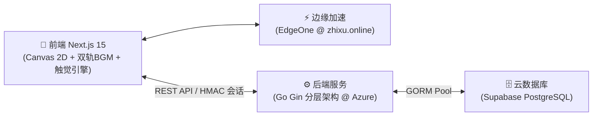

# 🐍 贪吃蛇 (Snake) - 极简全栈现代版

[](https://nextjs.org/)
[](https://gin-gonic.com/)
[](https://supabase.com/)
[](https://opensource.org/licenses/MIT)

> 🌟 **在线即玩**：[https://zhixu.online](https://zhixu.online)  
> 📖 **设计理念**：极简纯白留白现代美学 (NCU HOME 视觉风格) + 天青蓝 (`#66CCFF` / `#0099FF`) + 纯代码级矢量无 Emoji 极简设计 + 视听触三位一体沉浸体验。

---

## 🏛️ 系统架构



---

## 🌟 核心特性

- 🎨 **天青蓝现代极简美学**：纯白/浅灰底板 + 天青蓝主色 + 极薄无阴影细线边框，辅以多巴胺四色微点缀与纯矢量线性图标（0 系统 Emoji）。
- 🌙 **深空墨蓝夜间模式 (OLED Deep Dark)**：纯矢量超椭圆日/月切换微拟态按钮；全局注入 `#0A0F1D` 深空变量；Canvas 离屏背景实时重绘深邃网格。
- 🖼️ **走位几何抽象艺术卡片 (Generative Trajectory Art)**：
  - 基于 **Chaikin 2阶样条倒角算法**，将 90° 直角折线平滑为流体书法拓扑折线；
  - 融合**时序色彩渐变**（天青蓝 ➔ 深天蓝 ➔ 连击金 ➔ 暮光紫）与**半透明走位热力密度叠合**；
  - 离屏渲染 900×1200 瑞士国际主义海报，配备等宽战绩看板与 NCU HOME 28% 超椭圆朱红拟物印章，支持一键复制与下载。
- 📋 **极简 ASCII 瑞士国际主义战报**：结算面板支持一键复制终端级纯文本战报，整齐等宽对齐，集成走位海报校验链接。
- 📜 **本地对局档案谱**：风云榜集成双模胶囊切换，断网与弱网下亦能自动归档最近 10 局对局，支持随时重温与离线唤起走位几何海报。
- ⏳ **外置金果流光时空导轨与物理时钟对齐**：
  - 彻底淘汰 Canvas 内顶部进度条，在状态区与棋盘间开辟外置流光导轨，实现棋盘全视野 100% 清透；
  - 金果倒计时、临期急速频闪与 3 秒连击时钟完全改由物理步序（Simulation Tick）驱动，起步等待态与暂停态物理冻结，消除现实时钟漂移。
- 🌊 **蛇身逐节流体吞咽波 (Organic Digestion Wave)**：进食时正弦微隆起波（40ms/节）从蛇头传导至蛇尾，内部叠加晶莹自发光核（金果流金炽白），赋予流体物理生命力。
- 🐍 **灵动微表情与石化余温微动效**：
  - **蛇头情绪状态机**：正前方死角时触发濒死惊慌神态（瞳孔骤缩+高频微颤）、吃果触发治愈月牙笑眼、落幕触发释然闭目；
  - **死路余温石化冷却**：蛇尾蜕下的栅栏在前 180ms 内由浅天青渐变冷却为浅灰石化，告别方块突兀硬刷；
  - **等宽数字防抖动**：全局数值采用 `tabular-nums` 严格等宽对齐，彻底消除数字跳动时的界面抽搐。
- ⚡ **3秒极速连击与阶梯加成**：红果与金果统一进入 3000ms 物理连击时钟；2 连击激活蛇身耀金流光；第 3 次起触发阶梯额外奖励（+5/+10...累加）；剩余 1 秒急促橙红频闪。
- 📳 **视听触三位一体系统**：
  - **多层级触觉引擎**：支持【强力 / 轻柔 / 关闭】三档切换，触觉职责严格单向分层，杜绝双重误触；
  - **温润声学微雕与声卡自愈**：Web Audio 原生合成器接入 2600Hz 低通滤波；暂停时平滑降至 360Hz 沉水声场；发声前自动检测并唤醒 `suspended` 挂起状态；
  - **主机级双轨 BGM**：大厅温馨吉他与局内元气音乐智能转场，高光 Jingle 智能音频避让（Audio Ducking）与 55Hz 低频心跳脉冲。
- 🏆 **24 枚多巴胺微拟态成就殿堂**：超椭圆圆角底座、不规则灵动曲线、主辅双色共生与暗态/亮态动态激活，配备局中悬浮微弹窗与专属华丽大和弦。
- 🎥 **电竞对局录像回放剧场**：风云榜支持一键【🎥 观摩走位】，支持 `1.0x / 1.5x / 2.0x` 倍速切换与全物理轨迹重放。
- 🛡️ **Level 3 物理重放防作弊**：确定性伪随机种子 (Mulberry32) + Go 后端 1ms 无头物理重放验算真实战绩，辅以无状态 HMAC 防伪令牌与滑动限流。
- 📱 **多端全分辨率与高分屏超清适配**：全屏滑屏与微型虚拟十字键双模自适应；Canvas 接入 `window.devicePixelRatio` 缩放物理缓冲区，高分屏超清锐利。
- 🎛️ **极简音频与触感控制中心**：Header 集成 BGM 音量、SFX 音量独立分轨控制滑块与全屏无感透明遮罩。

---

## 📂 目录结构

```text
├── client/                     # 📱 前端 (Next.js 15 App Router + SSG 静态导出)
│   ├── app/                    # 页面入口、PWA Manifest 与全局样式
│   ├── components/             # Board (Canvas 引擎), TrajectoryCardModal (走位艺术海报), Header, Achievements, Leaderboard, Tutorial
│   ├── hooks/                  # useSnake (确定性时序引擎 & 轨迹采集), useAuth (认证持久化)
│   ├── services/api.ts         # REST API 封装 (HMAC 会话握手 & 录像轨迹验算)
│   ├── utils/achievements.ts   # 24 枚成就定义与达成检测引擎
│   ├── utils/audio.ts          # Web Audio API 8-bit 原生合成器 (低通温润滤波 & 沉水透传)
│   ├── utils/haptics.ts        # 工业级多层级触觉振动反馈管理器
│   ├── utils/prng.ts           # Mulberry32 跨语言 32 位确定性 PRNG
│   └── public/                 # 静态资源、矢量图标、音效与 PWA Service Worker
│
├── server/                     # ⚙️ 后端 (Go 1.22+ Gin 标准分层架构)
│   ├── main.go                 # 服务入口、路由配置与优雅停机
│   ├── pkg/engine/             # 1ms 无头物理重放与作弊校验引擎 (含 3 秒连击与阶梯加分)
│   ├── pkg/security/           # 无状态 HMAC 会话令牌与滑动窗口限流器
│   ├── pkg/database/           # GORM 数据库连接池与自动迁移
│   ├── replay_test.go          # 物理重放与防作弊单元测试
│   ├── security_audit_test.go  # 越权、数据篡改与超速外挂安全审计测试
│   └── Dockerfile              # 多阶段容器构建
│
├── docs/                       # 📖 课程实践报告与架构设计规范 (含 Generative Art 说明)
├── supabase/migrations/        # 🗄️ 数据库 SQL 全量与增量迁移文件
├── AGENTS.md                   # 📜 项目开发宪法与技术规范
└── README.md                   # 📖 项目说明文档
```

---

## 🚀 快速上手

### 1. 后端启动
```bash
cd server && go run main.go
# 监听 http://localhost:8080
```

### 2. 前端启动
```bash
cd client && npm install && npm run dev
# 浏览器访问 http://localhost:3000
```

---

## 📜 开源协议

本项目遵循 [MIT License](LICENSE) 协议。
