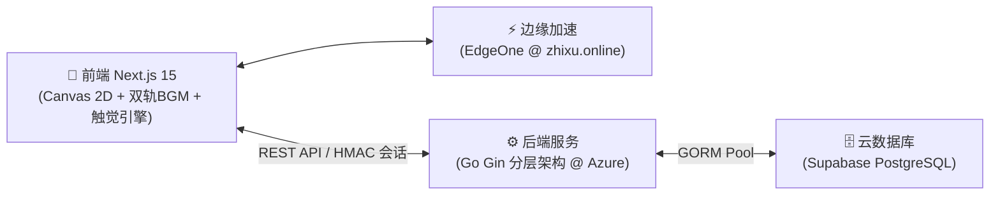

# 🐍 贪吃蛇 (Snake) - 极简全栈现代版

[](https://nextjs.org/)
[](https://gin-gonic.com/)
[](https://supabase.com/)
[](https://opensource.org/licenses/MIT)

> 🌟 **在线即玩**：[https://zhixu.online](https://zhixu.online)  
> 📖 **设计理念**：南大家园纯白留白美学 + 天青蓝 (`#66CCFF` / `#0099FF`) + 纯矢量无 Emoji 极简设计 + 视听触三位一体沉浸体验。

---

## 🏛️ 系统架构



---

## 🌟 核心特性

- 🎨 **南大天青蓝现代美学**：纯白/浅灰底板 + 天青蓝主色 + 极薄无阴影细线边框，辅以多巴胺四色微点缀与纯矢量线性图标（0 系统 Emoji）。
- 📳 **视听触三位一体系统**：
  - **多层级触觉引擎**：支持【强力 / 轻柔 / 关闭】三档切换，配备连击阶梯脉冲、极速心跳搏动与 UI 刻度吸附震感；
  - **Canvas 2D 物理微动效**：冲击波扩散光环（Shockwave）、极速运动残影（Motion Trail）、金果临期急速频闪（Strobe Warning）与灵动双眼视线追踪；
  - **主机级双轨 BGM**：大厅温馨吉他与局内元气音乐智能转场，支持高光 Jingle 智能音频避让（Audio Ducking）与 55Hz 低频心跳脉冲。
- 🏆 **24 枚全矢量成就殿堂**：青铜、白银、黄金、钻石四阶梯 24 枚四字成就，配备局中悬浮微弹窗与专属华丽大和弦。
- 🎥 **电竞对局录像回放剧场**：风云榜支持一键【🎥 观摩走位】，支持 `1.0x / 1.5x / 2.0x` 倍速切换与全物理轨迹重放。
- 🛡️ **Level 3 物理重放防作弊**：确定性伪随机种子 (Mulberry32) + Go 后端 1ms 无头物理重放验算真实战绩，辅以无状态 HMAC 防伪令牌与滑动限流。
- 📱 **多端全分辨率智能自适应**：全屏滑屏（Swipe）与微型虚拟十字键双模自适应，高分屏 DPR 像素矩阵抗锯齿超清渲染。
- 🎛️ **极简音频与触感控制中心**：Header 集成 BGM 音量、SFX 音量独立分轨控制滑块与全屏无感透明遮罩。

---

## 📂 目录结构

```text
├── client/                     # 📱 前端 (Next.js 15 App Router + SSG 静态导出)
│   ├── app/                    # 页面入口、PWA Manifest 与全局样式
│   ├── components/             # Board (Canvas 引擎), Header (控制中心), Achievements, InGameToast, Leaderboard
│   ├── hooks/                  # useSnake (确定性时序引擎), useAuth (认证持久化)
│   ├── services/api.ts         # REST API 封装 (HMAC 会话握手 & 录像轨迹验算)
│   ├── utils/achievements.ts   # 24 枚成就定义与达成检测引擎
│   ├── utils/audio.ts          # Web Audio API 8-bit 原生合成器与双轨 BGM 状态机
│   ├── utils/haptics.ts        # 工业级多层级触觉振动反馈管理器
│   ├── utils/prng.ts           # Mulberry32 跨语言 32 位确定性 PRNG
│   └── public/                 # 静态资源、矢量图标、音效与 PWA Service Worker
│
├── server/                     # ⚙️ 后端 (Go 1.22+ Gin 标准分层架构)
│   ├── main.go                 # 服务入口、路由配置与优雅停机
│   ├── pkg/engine/             # 1ms 无头物理重放与作弊校验引擎
│   ├── pkg/security/           # 无状态 HMAC 会话令牌与滑动窗口限流器
│   ├── pkg/database/           # GORM 数据库连接池与自动迁移
│   ├── replay_test.go          # 物理重放与防作弊单元测试
│   ├── security_audit_test.go  # 越权、数据篡改与超速外挂安全审计测试
│   └── Dockerfile              # 多阶段容器构建
│
├── docs/                       # 📖 课程实践报告与架构设计
├── supabase/migrations/        # 🗄️ 数据库 SQL 全量与增量迁移文件
├── AGENTS.md                   # 📜 项目开发宪法与技术规范
└── README.md                   # 📖 项目说明文档
```

---

## 🚀 快速上手

### 1. 后端启动
```bash
cd server && go run main.go
# 监听 http://localhost:8080
```

### 2. 前端启动
```bash
cd client && npm install && npm run dev
# 浏览器访问 http://localhost:3000
```

---

## 📜 开源协议

本项目遵循 [MIT License](LICENSE) 协议。
