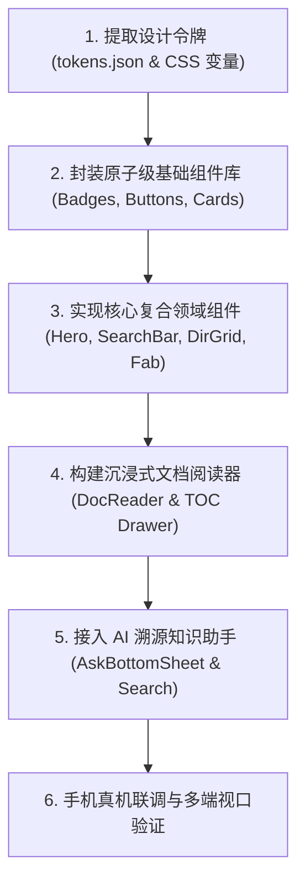

# 《此间 · 南大指南》极简移动端原型设计规范与重构方案

> **文件来源**：依据 `client/原型图/better.html`（南大家园 · 极简精修版原型）深度提炼与逆向工程重构规范。  
> **设计定位**：纯白底色、克制色彩、人文排版、无多余装饰、移动优先（Mobile-First）的现代高校知识库与 AI 问答平台。

---

## 🎨 一、 核心设计美学与设计哲学 (Design Philosophy)

1. **纯白极简基调 (Pure White & Subtlety)**：
   - 页面背景完全摒弃厚重灰底或炫彩渐变，采用 **纯白 (`#FFFFFF`)** 作为阅读与浏览的呼吸底色。
   - 层次划分依赖**浅灰细边线 (`#E2E8F0` / `#EDF2F7`)** 和**均匀对称的呼吸间距**，而非大面积色块堆叠。

2. **人文排版与留白呼吸感 (Humanistic Typography)**：
   - **单行大标题**：首页 Hero 采用单行不换行大字号排版（`24px`，字重 800，紧凑字间距 `-0.02em`），气势从容。
   - **金句竖线引用**：引用金句左侧配置 `3px` 经典天蓝竖线，传达沉静温和的人文关怀。
   - **对称间距**：标题、顶线与条目之间严格保持等距上下留白，杜绝视觉逼仄感。

3. **矢量纯粹主义 (Pure Vector & Zero Emoji)**：
   - 全站 100% 采用 **Lucide 风格纯矢量线性图标 (`stroke-width: 1.8`)**，彻底杜绝 Emoji 表情符号带来的视觉杂乱与风格不统一。
   - 保留南大家园吉祥物矢量徽标，在关键节点作为轻量点睛元素。

---

## 🌈 二、 色彩系统与设计令牌 (Design Tokens)

### 1. 核心品牌色 (Primary Brand)
| Token 变量 | 色值 | 用途与语义 |
| :--- | :--- | :--- |
| `--primary-cyan` | `#66CCFF` | 经典天蓝主色（重点边框、竖线强调、阅读进度条） |
| `--primary-dark` | `#0099FF` | 深天蓝强调（超链接、主要操作按钮、激活态高亮） |
| `--primary-light` | `#EBF8FF` | 浅天蓝底色（公告栏底色、信息提示卡片底色） |
| `--primary-subtle` | `#F6FBFF` | 极浅天蓝悬停（列表项 Hover / 选中高亮） |

### 2. 六大知识板块专属色彩系统 (Section Badges)
板块数字采用 **等宽无前导零、粗体几何单字数字徽标（1~6）**，圆角弧度与卡片一致（`6px`）：

| 板块序号 & 名称 | 背景色 Token (`bg`) | 文字色 Token (`text`) | 视觉色彩意象 |
| :--- | :--- | :--- | :--- |
| **1. 写在前面** | `#E0F2FE` (`--badge-1-bg`) | `#0284C7` (`--badge-1-text`) | 天青蓝（缘起与初探） |
| **2. 黄页电话** | `#FFE4E6` (`--badge-2-bg`) | `#E11D48` (`--badge-2-text`) | 珊瑚红（紧急报警与应急） |
| **3. 课程学业** | `#DCFCE7` (`--badge-3-bg`) | `#16A34A` (`--badge-3-text`) | 翡翠绿（培养方案与学分） |
| **4. 学习发展** | `#EDE9FE` (`--badge-4-bg`) | `#7C3AED` (`--badge-4-text`) | 活力紫（新生进阶与规划） |
| **5. 校园生活** | `#FEF3C7` (`--badge-5-bg`) | `#D97706` (`--badge-5-text`) | 暖琥珀（后勤、设施与日常） |
| **6. 经验锦囊** | `#EEF2FF` (`--badge-6-bg`) | `#4F46E5` (`--badge-6-text`) | 靛蓝色（学长学姐实战经验） |

### 3. 文字与灰阶层级 (Typography & Neutral Greys)
| 层次 | 变量名 | 色值 | 应用场景 |
| :--- | :--- | :--- | :--- |
| **标题深黑** | `--text-main` | `#0F172A` | 页面主标题、文章 H1/H2、导航品牌名 |
| **正文沉稳灰** | `--text-body` | `#334155` | 文章正文字段、列表正文、对话气泡文字 |
| **辅助说明灰** | `--text-muted` | `#94A3B8` | 面包屑、更新时间、计数器、占位提示文字 |
| **页面基底** | `--bg-page` | `#FFFFFF` | 纯白内容页面基底 |
| **边框分隔线** | `--border-line` | `#E2E8F0` | 卡片描边、分割中线、列表底线 |

### 4. 几何圆角与阴影体系 (Radius & Elevation)
```css
--radius-xs: 4px;
--radius-sm: 6px;
--radius-md: 10px;
--radius-lg: 14px;
--radius-pill: 9999px; /* 胶囊圆角 */

--shadow-sm: 0 1px 2px rgba(0, 0, 0, 0.03);
--shadow-float: 0 4px 16px rgba(0, 153, 255, 0.18), 0 1px 3px rgba(0, 0, 0, 0.05); /* 悬浮吉祥物柔和天蓝光晕 */
--shadow-drawer: 0 12px 36px rgba(15, 23, 42, 0.16); /* 抽屉与浮层深阴影 */
```

---

## 🧩 三、 核心交互组件规范与契约 (Component Contracts)

### 1. 首页 Hero 人文标语区 (`HomeHero`)
- **排版结构**：
  - `h1.hero-title`：`24px` / `800` 字重，`margin-bottom: 20px`，强制 `white-space: nowrap` 保持单行张力；
  - `blockquote.hero-quote`：左侧 `3px solid var(--primary-cyan)`，内边距 `0 0 0 10px`；正文字号 `12.5px`，行高 `1.65`。

### 2. 搜索与小家园复合胶囊栏 (`SearchCompositeBar`)
- **尺寸与外观**：高度 `46px`，全圆角胶囊（`border-radius: 9999px`），纯白背景 + `1.5px solid var(--border-line)`。
- **内部三段式流转**：
  - **左侧**：搜索放大镜矢量图标 + `13px` 辅助灰搜索占位文案（*“搜索手册词条，或向小助手提问...”*）；
  - **中间**：`1px × 20px` 浅灰垂直细分隔线 (`search-divider`)；
  - **右侧**：内嵌白底蓝字 **「问问小家园」** 快捷按钮（带右侧微型吉祥物 Logo），点击即刻升起 AI 底部问答浮层。

### 3. 手册公告栏 (`NoticeCard`)
- **外观**：浅天蓝背景 (`#EBF8FF`) + 左侧 `3.5px solid var(--primary-cyan)` 强调条 + `10px` 圆角。
- **元素**：纯矢量铃铛小图标 + 粗体「手册公告」标签 + 沉稳蓝正文 (`#0369A1`) + 重点文档超链接。

### 4. 双列断开式知识目录列表 (`DirSection`)
- **布局**：`display: grid; grid-template-columns: 1fr 1fr; column-gap: 24px;`。
- **细节美学**：
  - 目录标题下方配置浅灰细顶线，上下间距对称；
  - 每个板块行底部配置 `1px` 浅灰底线，**由于存在 `24px` 列间距，左右两列底线中间自然断开**，呈现极其精致的书本感；
  - **最后一行条目自动移除底线** (`dir-item-row-last`)，不留多余痕迹；
  - 采用 `22px × 22px` 等宽粗体单字几何数字徽标（1~6）。

### 5. 纯净悬浮 AI 吉祥物入口 (`FabMascot`)
- **形态**：右下角常驻固定 `50px × 50px` 纯圆形白底悬浮按钮，脱离正文滚动流。
- **阴影**：特别调制的 **0 4px 16px rgba(0, 153, 255, 0.18)** 柔和天蓝光晕。
- **克制原则**：**不出现任何常驻文字提示气泡 (No Text Tooltip)**，保持页面纯净；点击平滑触发半屏 AI 知识浮层。

### 6. 移动优先沉浸式阅读器 (`DocReader`)
- **吸顶阅读进度条**：顶栏正下方吸顶 `2.5px` 天蓝进度细线，随正文滚动实时更新百分比宽度。
- **元信息区**：面包屑导航（如 `学习发展 › 新生专栏`）+ 21px 粗体 H1 标题 + 更新年份与阅读时长。
- **正文排版**：
  - 二级标题 `h2` 左侧配置 `4px × 15px` 天蓝小圆角竖条；
  - 警示卡片：提供 `alert-card-danger`（浅红底红边，重要防诈/报警）与 `alert-card-info`（浅蓝底蓝边，技巧指引）；
  - 对比表格：清爽圆角双列对比表（如推销话术 vs 真实情况）；
  - 底部模块：**下一篇导航卡片** + **“有用/没帮上”即时反馈栏**。

### 7. 抽屉与浮层交互体系 (Drawers & Sheets)
- **左侧全量目录抽屉 (`SideDrawer`)**：宽度 84%（最大 328px），从左侧平滑滑出，带遮罩毛玻璃模糊。
- **底部 AI 知识助手浮层 (`AskBottomSheet`)**：从底部滑起（最大高度 82%），支持预设 Prompt 推荐、连续问答与文档精准溯源。
- **全屏搜索视图 (`SearchFullscreenView`)**：全屏覆盖，顶部搜索框 + 横向滑动板块过滤标签 Chips（全部、学习发展、校园生活...）+ 关键词实时高亮。

---

## 📐 四、 移动端适配与工程规范 (Engineering Constraints)

1. **核心视口标准**：
   - 优先基于 **360px、390px（iPhone 14/15 黄金基准）、430px** 宽度进行流式与弹性布局设计；
   - 触控目标（Buttons / Links / Inputs）最小尺寸确保不小于 **44px**，杜绝误触。

2. **滚动体验**：
   - 全局隐藏原生滚动条 (`::-webkit-scrollbar { display: none; }`)；
   - 保持 iOS 原生丝滑回弹与惯性滚动阻尼感 (`-webkit-overflow-scrolling: touch`)。

---

## 🚀 五、 下一步代码重构实施路线图 (Roadmap)



1. **第一阶段：设计系统落地**
   - 将本规范中的所有色值、圆角、阴影写入全局主题变量，确保全站样式统一无硬编码。
2. **第二阶段：组件解耦与封装**
   - 封装 `SearchCompositeBar`、`NoticeCard`、`DirSection`、`DocReader`、`FabMascot` 等独立高内聚组件。
3. **第三阶段：状态与路由流转**
   - 串联 首页 ➔ 文档阅读 ➔ 全屏搜索 ➔ AI 抽屉 的单页无刷新平滑切换。
