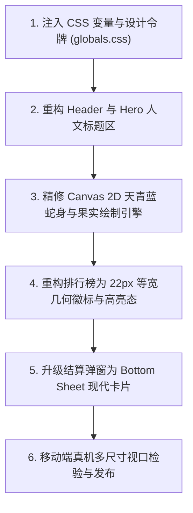

# 🐍 《贪吃蛇》极简现代主义游戏设计规范与重构方案

> 📖 **设计溯源**：深度融合 `better.html`（南大家园极简精修版原型）的纯白极简哲学、人文留白排版与等宽几何徽标体系，将传统街机像素游戏升华为现代化、呼吸感与高级感并存的移动优先 Web 游戏产品。  
> 🌟 **核心品牌色**：天青蓝（经典主色 **`#66CCFF`**）+ 深天蓝强调（**`#0099FF`**）。

---

## 🎨 一、 核心设计美学与视觉哲学 (Aesthetics & Philosophy)

1. **纯白极简基调 (Pure White Baseline)**：
   - 彻底摒弃传统游戏暗黑压抑或高饱和杂乱背景，采用 **纯白 (`#FFFFFF`)** 与 **极浅天蓝 (`#F6FBFF`)** 作为游戏主舞台；
   - 依赖 **浅灰细边线 (`#E2E8F0` / `#EDF2F7`)** 和 **几何胶囊圆角** 划分层次，呈现如现代艺术品般的方寸空间。

2. **人文排版与呼吸留白 (Humanistic Typography & Rhythm)**：
   - **主标引言**：顶部以单行大字号 **“方寸之间，重温经典。”** 为视觉引力，搭配左侧 `3px` 天青蓝 (`#66CCFF`) 竖线金句；
   - **无衬线粗体数字**：得分、用时、排行榜名次统一使用 `DIN Alternate` / `SF Pro Display` 笔画等宽几何数字，紧凑干练。

3. **矢量纯粹与无 Emoji 界面原则 (Vector Pure & Zero Clutter)**：
   - 全局界面 100% 采用 **Lucide 线性矢量图标 (`stroke-width: 1.8`)**，杜绝 Emoji 带来的色彩噪点与视觉杂乱；
   - 画布内蛇身、果实采用极简几何圆角（Pill Radius）配合微阴影，兼具复古韵味与现代丝滑质感。

---

## 🌈 二、 游戏专属设计令牌与色彩系统 (Design Tokens)

### 1. 核心品牌色系 (Primary Brand)
| Token 变量 | 色值 | 用途与游戏视觉映射 |
| :--- | :--- | :--- |
| `--primary-cyan` | **`#66CCFF`** | **核心天青蓝**（蛇头主色、主要强调边框、速度进度指示条、重点竖线） |
| `--primary-dark` | `#0099FF` | **深天蓝交互色**（主要 CTA 按钮、激活状态、最高分文字高亮） |
| `--primary-light` | `#EBF8FF` | **浅天蓝底色**（当前玩家战绩徽标底色、状态栏背景） |
| `--primary-subtle` | `#F6FBFF` | **极浅天蓝背景**（排行榜当前玩家「我」专属高亮行背景） |

### 2. 游戏元素色彩矩阵 (Game Elements)
| 元素类型 | 颜色 Token | 色值 | 渲染形态与动效 |
| :--- | :--- | :--- | :--- |
| **蛇头 (Snake Head)** | `--snake-head` | `#66CCFF` | `6px` 几何圆角矩形，嵌入极简双点灵动眼神 |
| **蛇身 (Snake Body)** | `--snake-body` | `#38BDF8` ~ `#7DD3FC` | 纯色天蓝平滑渐次递减，高内聚圆润骨骼感 |
| **基础食物 (Food)** | `--food-apple` | `#EF4444` (红) + `#22C55E` (叶) | 经典圆润红苹果，带 `2px` 翠绿极简叶芽 |
| **金色幸运果 (Bonus)** | `--food-gold` | `#F59E0B` (金) + `#FEF3C7` (光晕) | 8 秒限时五角星幸运果，带呼吸脉冲微光晕 |
| **网格背景 (Grid)** | `--game-grid` | `#F8FAFC` 网格线 `#EDF2F7` | 纯白主画布内嵌 `20px` 隐形极简细格网 |

### 3. 榜单等宽单字多色系统 (Rank Badges 1~10)
排行榜名次采用 `better.html` 原生 **22px × 22px 等宽几何粗体数字徽标**（圆角 `6px`，与卡片一致）：

| 排名 | 背景色 Token | 文字色 Token | 荣誉象征 |
| :--- | :--- | :--- | :--- |
| **第 1 名** | `#FEF3C7` (`--badge-gold-bg`) | `#D97706` (`--badge-gold-text`) | 暖琥珀金（全服冠军） |
| **第 2 名** | `#E0F2FE` (`--badge-cyan-bg`) | `#0284C7` (`--badge-cyan-text`) | **天青蓝 (`#66CCFF` 衍生)**（全服亚军） |
| **第 3 名** | `#DCFCE7` (`--badge-green-bg`) | `#16A34A` (`--badge-green-text`) | 翡翠绿（全服季军） |
| **第 4~10 名** | `#F1F5F9` (`--badge-slate-bg`) | `#64748B` (`--badge-slate-text`) | 沉稳石板灰（十强学子） |

---

## 🧩 三、 贪吃蛇各模块交互组件契约 (Game Component Specs)

### 1. 游戏导航顶栏 (`GameHeader`)
- **外观**：高度 `48px`，纯白毛玻璃粘性吸顶，底沿 `1px solid var(--border-line)`。
- **左侧**：天青蓝 (`#66CCFF`) 极简贪吃蛇徽标 + 粗体 `贪吃蛇` + 胶囊 `南大家园` 标签。
- **右侧操作区**：
  - 8-bit 音效静音切换键（圆形 36px 纯矢量喇叭图标，带开关波纹）；
  - 当前玩家胶囊身份栏（展示登录账号或一键登录按钮）。

### 2. 人文标语与实时战况复合栏 (`HeroStatusBar`)
- **人文标语**：
  ```html
  <div class="hero-wrap">
    <h1 class="hero-title">方寸之间，重温经典。</h1>
    <blockquote class="hero-quote">
      <p>在方格与节奏的律动中，探寻每一次转身的从容。</p>
    </blockquote>
  </div>
  ```
- **三段式复合数据胶囊 (`ScoreCompositeBox`)**：
  - **当前得分**：实时滚动累加，粗体 `20px`，天青蓝点缀；
  - **最高纪录**：带有小皇冠矢量图标，沉稳深黑；
  - **动态速度梯度**：胶囊徽标实时显示 `速度 1.0x ~ 2.2x`（天青蓝底浅蓝字）。

### 3. 极简现代画布舞台 (`GameBoard Canvas`)
- **容器规格**：黄金视口适配（24×24 格，手机端自适应缩放）；
- **外框美学**：纯白底板 + `1.5px solid var(--border-line)` + `14px` 大圆角 + 微阴影；
- **金果限时进度条**：幸运果出现时，在画布上沿投射一条 `2.5px` 金色渐变倒计时微流光（8 秒均匀递减）。

### 4. 移动端极简微型十字控制台 (`VirtualDPad`)
- **展示策略**：PC 键盘端自动隐藏，触屏设备自适应浮现；
- **形态契约**：半透明极简十字排列，浅灰细线边框，手指点击触发轻微缩放（`transform: scale(0.92)`）与天蓝涟漪反馈。

### 5. 沉浸式战绩排行榜 (`LeaderboardCard`)
- **结构规范**：
  - 标题栏：`Top 10 风云榜` + 实时玩家总数；
  - 细顶线与断开式底线：每一行玩家记录底部带浅灰细线，列间自然留白；
  - **当前玩家高亮行**：若当前玩家在榜，整行赋予 `var(--primary-subtle)` 极浅天蓝背景，右侧标注 `我` 胶囊；
  - 战绩评语：底部动态呈现 *“超越了全服 92.5% 的学子，傲视群雄！”*。

### 6. 游戏结算与复活弹窗 (`GameOverModal`)
- **呈现形态**：仿 iOS 原生 Bottom Sheet 从底部升起，带毛玻璃遮罩；
- **数据面板**：
  - 本次得分、存活时间、历史最高分；
  - 纯矢量奖章图标（打破纪录时投射天青蓝 `#66CCFF` 礼花微动效）；
- **操作按钮**：宽屏胶囊「再来一局」（深天蓝背景 `#0099FF`，白色粗体字，高度 44px 舒适触控）。

---

## 📐 四、 响应式与移动优先体验契约 (Mobile-First Specs)

```text
360px (紧凑屏)  ───►  390px (黄金标准机身)  ───►  430px (大屏旗舰)  ───►  桌面端 (居中手机视口)
 页面单列自适应        全尺寸 Canvas (1:1)       复合控制栏展开         固定 480px 优雅居中卡片
```

1. **触控目标保障**：所有可交互按键（重玩、方向、登录、静音）尺寸均不低于 **44px × 44px**；
2. **手势操作**：支持全屏手指滑动（Swipe 上下左右），与双指令排队缓冲机制完美协同；
3. **零卡顿渲染**：Canvas 2D 双缓冲 60fps 驱动，纯数学逻辑运算，无垃圾回收卡顿。

---

## 🚀 五、 前端组件重构实施路线图 (Implementation Roadmap)


